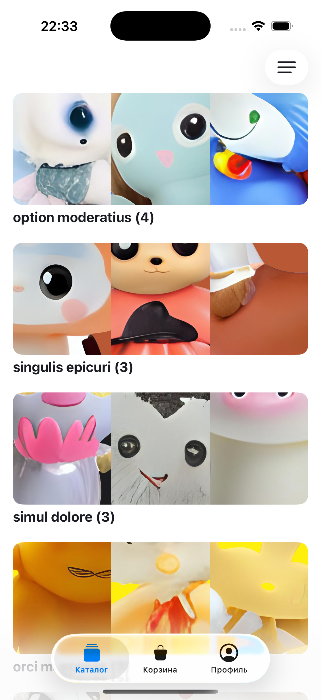
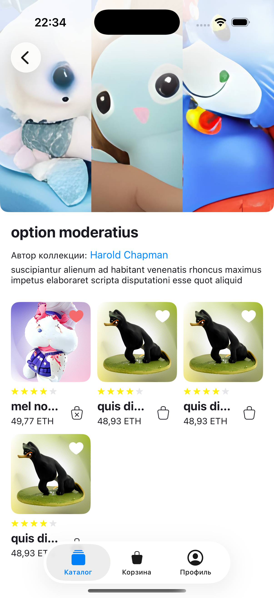
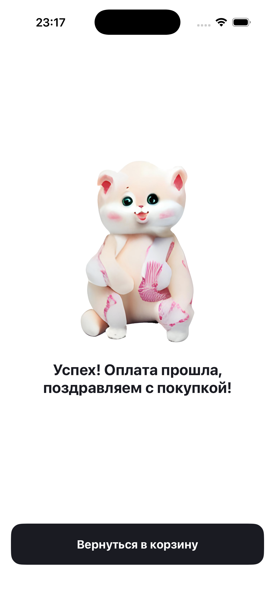
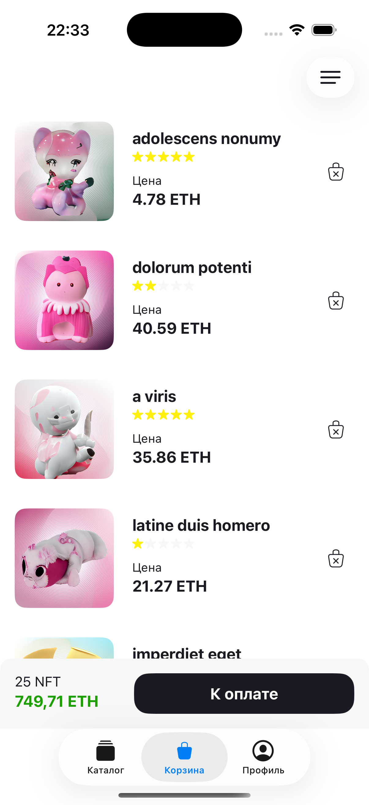
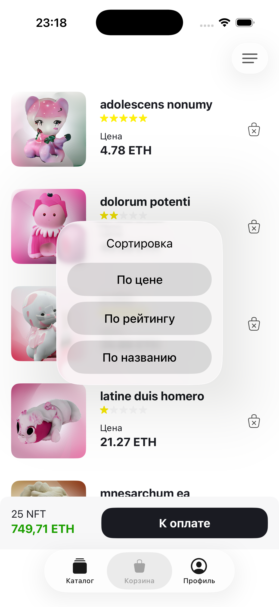
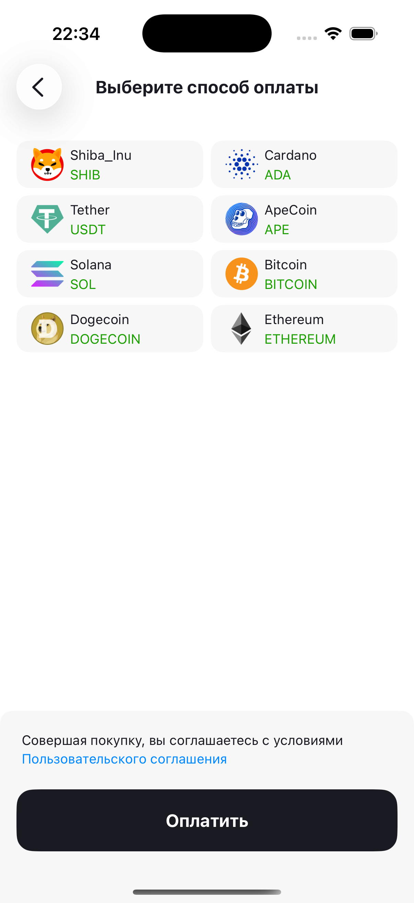
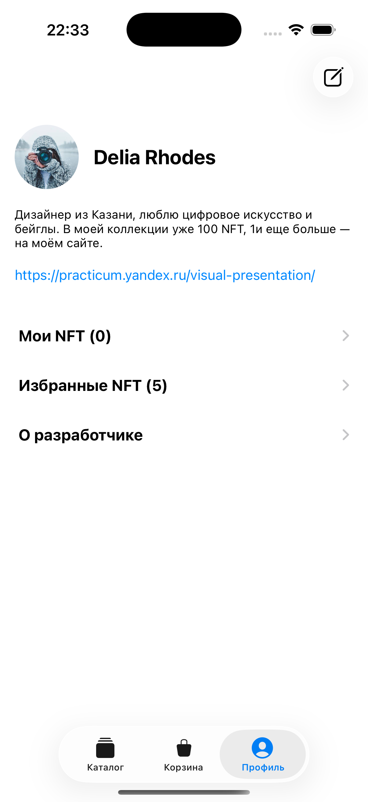
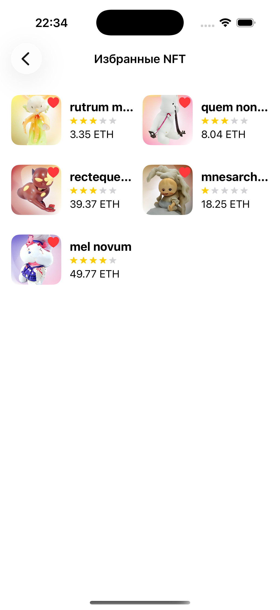
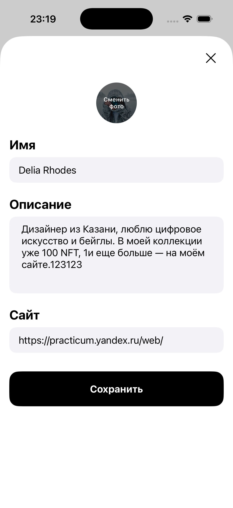

# FakeNFT

iOS-приложение для просмотра и покупки NFT (Non-Fungible Token). Приложение позволяет знакомиться с NFT-коллекциями, управлять избранным и корзиной, а также просматривать профиль пользователя. Сценарий покупки имитируется с помощью mock-сервера. Проект разработан командой из трёх iOS-разработчиков.

## Демо

https://github.com/user-attachments/assets/65b504d1-f114-4988-b54d-b9f4052d6b32

## Основной функционал

* Просмотр каталога NFT-коллекций и сортировка коллекций по названию или количеству NFT.
* Просмотр информации о выбранной коллекции, ее авторе и входящих в нее NFT.
* Просмотр NFT в избранном и удаление из него.
* Просмотр NFT в корзине и удаление с подтверждением.
* Просмотр состава корзины, количества товаров и общей стоимости заказа в ETH.
* Сортировка NFT в корзине по названию, цене или рейтингу.
* Выбор валюты и имитация оплаты заказа через API.
* Повторная попытка оплаты при возникновении ошибки.
* Переход на сайт с условиями пользовательского соглашения.
* Просмотр и редактирование профиля пользователя.
* Просмотр собственных и избранных NFT.
* Сортировка собственных NFT по названию, цене или рейтингу.
* Сохранение выбранных вариантов сортировки между запусками приложения.
* Локализация экранов на EN и RU. 
* Обработка сетевых ошибок с возможностью повторной загрузки данных.
* Отображение состояний загрузки и пустых списков.

## Требования и технологии

* iOS 17.0+
* Xcode 15+
* Swift 5
* UIKit + вёрстка кодом
* MVVM + замыкания
* URLSession
* REST API
* UserDefaults
* XCTest

## Мой вклад

В рамках проекта я реализовал полный цикл работы корзины и сценария оплаты NFT от интеграции API до успешной транзакции, внедрив кастомную сортировку, мультиязычную локализацию и механизм повторных попыток при сбоях.

Основные задачи:

* загрузка текущего заказа из API и получение детальной информации о NFT по идентификаторам;
* реализация состояний корзины: загрузка, обновление, список NFT, пустая корзина и обработка сетевых ошибок;
* расчет общего количества NFT и итоговой стоимости заказа;
* разработка UI корзины: список и ячейки NFT, пустое состояние, сортировка, итоговый блок и подтверждение удаления;
* поддержка локализации на экранах корзины и оплаты;
* сортировка NFT по цене, рейтингу и названию с локальным сохранением выбранного варианта;
* удаление NFT из заказа и обновление корзины после изменений;
* загрузка и выбор валюты, управление доступностью кнопки оплаты и открытие пользовательского соглашения;
* отправка запроса оплаты, обработка ошибок и возможность повторной попытки;
* завершение заказа и очистка корзины;
* разработка экрана успешной оплаты и возврата в корзину.

Подробная моя декомпозиция, оценка и фактическое время выполнения задач представлены в документе  
[«Декомпозиция эпика Корзина»](Docs/decomposition.md).

## Скриншоты

| Каталог | Детали коллекции | Успешная оплата |
|:-------:|:-------:|:----------------:|
|  |  |  |

| Корзина | Сортировка корзины | Оплата корзины |
|:---------:|:-------:|:------------:|
|  |  |  |

| Профиль | Избранное | Редактирование профиля |
|:---------------------:|:--------------------:|:----------------------:|
|  |  |  |

## Установка и запуск

1. Клонировать репозиторий:

```bash
git clone https://github.com/Tema82Rus/FakeNFT.git
```

2. Открыть проект в Xcode:

```bash
open FakeNFT.xcodeproj
```

3. Дождаться автоматической загрузки зависимостей через Swift Package Manager.

4. Выбрать симулятор iOS или подключенное устройство.

5. Собрать и запустить проект.

## Команда проекта
### iOS-разработчики:

* [Даня](https://github.com/Fermer3D) 
* [Илья](https://github.com/lupenq)
* **[Артём](https://github.com/Tema82Rus)**
